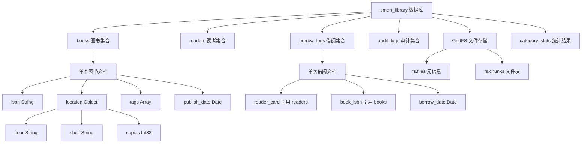
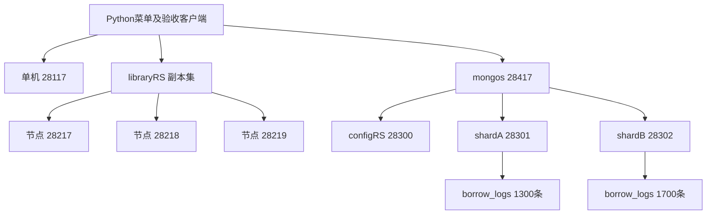

# 逻辑结构图

```mermaid
flowchart TD
 DB[smart_library 数据库] --> B[books 图书集合]
 DB --> R[readers 读者集合]
 DB --> L[borrow_logs 借阅集合]
 DB --> A[audit_logs 审计集合]
 DB --> F[GridFS 文件存储]
 DB --> S[category_stats 统计结果]
 B --> BD[单本图书文档]
 BD --> ID[isbn String]
 BD --> LOC[location Object]
 LOC --> FLOOR[floor String]
 LOC --> SHELF[shelf String]
 LOC --> COPY[copies Int32]
 BD --> TAG[tags Array]
 BD --> DATE[publish_date Date]
 L --> LD[单次借阅文档]
 LD --> BR[reader_card 引用 readers]
 LD --> BI[book_isbn 引用 books]
 LD --> TIME[borrow_date Date]
 F --> FF[fs.files 元信息]
 F --> FC[fs.chunks 文件块]
```

# 部署拓扑图

```mermaid
flowchart TD
 APP[Python菜单及验收客户端] --> SINGLE[单机 28117]
 APP --> RS[libraryRS 副本集]
 RS --> R1[节点 28217]
 RS --> R2[节点 28218]
 RS --> R3[节点 28219]
 APP --> M[mongos 28417]
 M --> CFG[configRS 28300]
 M --> A[shardA 28301]
 M --> B[shardB 28302]
 A --> AC[borrow_logs 1300条]
 B --> BC[borrow_logs 1700条]
```

全部节点绑定127.0.0.1，同机进程级教学环境。副本集及分片使用节点密钥与账号认证。单机仅用于本机基础功能演示。配置服务器与分片为单成员副本集，不具备节点冗余。
